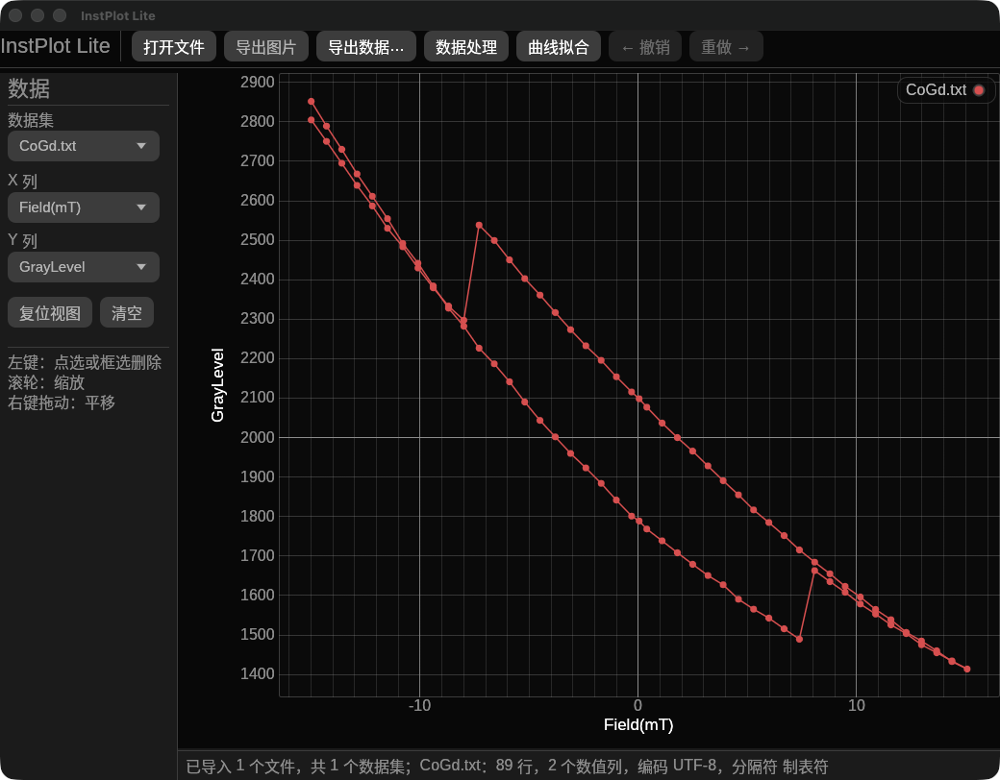
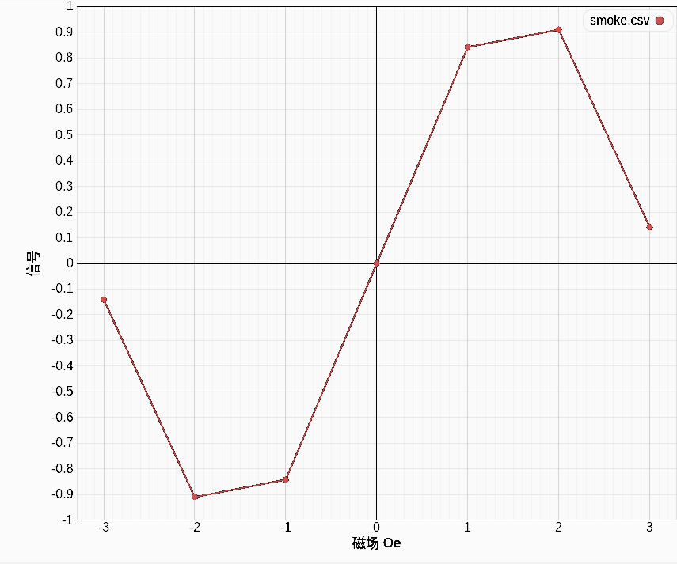

# InstPlot Lite — 轻量实验数据绘图工具

<div align="center">


**打开实验数据，立即看图、删点、处理、拟合并导出。**

无需 Python · 无需 Microsoft Excel · 无需终端命令

[](https://github.com/zhiyuzhang001-a11y/InstPlot-Lite/actions/workflows/instplot-lite.yml)
[](LICENSE)
[](https://github.com/zhiyuzhang001-a11y/InstPlot-Lite/releases)

## [前往下载页面](https://github.com/zhiyuzhang001-a11y/InstPlot-Lite/releases)

</div>

> [!IMPORTANT]
> 普通用户请从 **Releases** 页面的 **Assets** 区域下载安装包。不要点击仓库首页绿色
> **Code** 按钮里的 **Download ZIP**；那个 ZIP 是源代码，不是安装程序。

## 这是什么软件？

InstPlot Lite 面向需要快速查看实验数据的学生和科研人员。它适合完成日常工作中的第一步：确认数据是否正常、选择 X/Y 列、观察曲线、删除异常点、进行常用处理或基础拟合，再把清理后的数据和图片导出。

项目最初有一个功能完整的 Python 版本。为了让不熟悉编程的用户也能直接安装，并降低磁盘、内存和启动开销，我们使用 Rust 重新实现了 Lite 版。Lite 版保留最常用的交互和数据处理能力，但不以出版级绘图排版为目标。

所有数据处理都在本机完成；InstPlot Lite 本身不会上传实验数据。



## 下载与安装

当前公开版本是 **v0.3.0 未签名预览版**。请在 [Releases 页面](https://github.com/zhiyuzhang001-a11y/InstPlot-Lite/releases/tag/v0.3.0)向下找到 **Assets**，根据电脑选择文件。

> [!NOTE]
> 本页功能说明和截图对应当前开发主线。白底 PNG、滚轮缩放和跨系统界面一致性等近期改进
> v0.3.0 包含公式计算、多曲线处理、覆盖/保留写入选择和按列导出等改进。

### Windows 10 / 11（64 位）

下载 `InstPlot-Lite-0.3.0-windows-x64-setup.exe`，然后双击安装。安装器不要求管理员权限，并会创建开始菜单入口；安装时可以选择是否创建桌面快捷方式。

### macOS

- Apple 芯片（M1、M2、M3、M4 等）：下载 `InstPlot-Lite-0.3.0-macos-arm64.dmg`。
- Intel 芯片：下载 `InstPlot-Lite-0.3.0-macos-x86_64.dmg`。

不知道芯片类型时，点击屏幕左上角苹果图标，选择 **关于本机**：显示“芯片 Apple …”就选 `arm64`，显示“处理器 Intel …”就选 `x86_64`。打开 DMG 后，将 **InstPlot Lite** 拖入 **Applications（应用程序）**。

### Linux（64 位）

- Ubuntu / Debian：下载 `instplot-lite_0.3.0_amd64.deb`，用系统的软件安装器打开。
- 其他兼容发行版：下载 `InstPlot-Lite-0.3.0-linux-x86_64.tar.gz`，解压后运行其中的 `instplot-lite`。

### 第一次打开时的安全提示

预览版尚未购买 Apple 和 Microsoft 开发者证书，因此 Windows SmartScreen 或 macOS Gatekeeper 可能在第一次打开时显示安全提示。这不代表程序需要 Python 或联网安装依赖。请只从本仓库的 Release 页面下载，并可使用 Release 中的 `SHA256SUMS.txt` 核对文件。

## 三步开始使用

1. 点击 **打开文件**，或把数据文件直接拖进窗口。
2. 在左侧选择数据集、X 列和 Y 列；图形会自动更新。
3. 检查、处理或拟合数据，然后点击 **导出图片** 或 **导出数据…**。

### 鼠标操作

- 滚轮：以鼠标位置为中心放大或缩小。
- 右键拖动：平移图形。
- 左键单击：显示 `(x, y)`；靠近数据点时可选择并确认删除。
- 左键拖动：框选多个数据点并确认删除。
- **撤销 / 重做**：恢复或重新应用删除和数据处理操作。

### 数据处理与拟合

- **数据处理**：对称、归一化、多项式去背底、局部展平、Savitzky–Golay 去噪和按行公式计算。
- **公式计算**：公式引用 `x` 时处理 X 列，引用 `y` 时处理 Y 列；支持 `a`、`b` 系数、四则运算、括号、常用函数与常量。系数和拟合初值可直接填写 `10/11`、`(2+3)/7` 一类表达式。
- **多曲线处理**：可处理当前曲线、勾选的多条曲线或全部曲线；同一次操作会先验证所有目标，避免只处理一部分数据。
- **写入方式**：默认覆盖原列，并可通过撤销恢复；也可在窗口内统一选择保留为派生列。
- **曲线拟合**：1–10 阶多项式、指数、对数、幂函数和自定义表达式。
- **数据导出**：导出当前数据集时可勾选要写入的列；已有拟合曲线会自动作为独立数据区写在原始数据之后。
- 拟合由原生 Rust 实现，不需要 SciPy。

## 支持的文件格式

导入：

- TXT、CSV、DAT、TSV；支持一个文本文件内包含多个 BEGIN/END 数据区
- XLSX 和旧版 XLS
- UTF-8、UTF-16 和常见 GBK 编码
- 多工作表 Excel；每个有效数值工作表作为独立数据集

导出：

- 当前数据集：CSV、XLSX、TSV、TXT、DAT
- 全部数据集：默认可保存为一个分区式 CSV/TSV/TXT/DAT，也可保存为多个独立文本文件或一个多工作表 XLSX
- 图片：白底 PNG，使用黑色坐标与刻度、浅灰网格，并保留彩色曲线

当文本数据包含拟合结果时，InstPlot Lite 使用可读的分区边界：

```text
# -----BEGIN INSTPLOT DATA-----
# Name: 原始数据
# Type: source
...
# -----END INSTPLOT DATA-----
```

每个区域拥有独立的表头、列数和行数，并以 `Type: source` 或 `Type: fit` 保留原始/拟合类型；重新导入时会自动拆成互不影响的数据集。边界之外只允许空行和 `#` 注释，避免有效数据被静默忽略。没有这些边界的普通文本文件仍按原有方式读取。XLSX 使用原生工作表表达相同结构，原始数据工作表在前，拟合工作表在后。文本数据采用流式写出，导出多个大数据集时不会在内存中再复制整份合并文件或单个数据区。



## 轻量化情况

- 安装包约 4–6 MB，优化后的本机可执行文件约 7 MB。
- 软件自带英文和简体中文字体，不依赖电脑是否安装 Arial。
- 不安装 Python、Rust、SciPy、Matplotlib 或 Microsoft Excel。
- 大曲线只在显示时做保峰降采样；删除、命中检测和数据导出仍使用保留的完整数据。
- 实际内存取决于文件大小、列数和同时打开的数据集数量。

## 卸载

- Windows：打开 **设置 → 应用**，找到 **InstPlot Lite** 并卸载。
- macOS：把 **InstPlot Lite.app** 移到废纸篓。
- Ubuntu / Debian：在图形化软件管理器中点击移除。
- Linux 便携版：删除解压后的文件夹。

InstPlot Lite 不创建用户数据库、设置文件、日志或应用缓存，因此不需要额外清理用户目录。

## 当前限制

- 目前是未签名预览版，首次打开可能出现系统安全提示。
- 图片只导出 PNG；暂不提供出版级 SVG/PDF 排版和复杂样式编辑。
- 当前安装包覆盖 Windows x64、Apple Silicon、Intel Mac 和 Linux x64。
- 不同仪器厂商可能使用特殊 TXT/DAT 变体；遇到无法识别的文件时请反馈一个可公开的脱敏样本。

## 遇到问题

请在 [GitHub Issues](https://github.com/zhiyuzhang001-a11y/InstPlot-Lite/issues) 中说明：

- 使用的系统版本；
- 下载的安装包文件名；
- 操作步骤和错误文字；
- 如适用，附上截图或脱敏后的最小数据文件。

不要上传包含敏感实验信息的原始文件。

## 项目资料

- [文档导航](docs/README.md)
- [开发与源码构建说明](docs/DEVELOPMENT.md)
- [当前实现状态](docs/STATUS.md)
- [安装包构建说明](packaging/README.md)
- [许可证与第三方声明](THIRD_PARTY_NOTICES.md)
- [旧 Python 版源码与历史](https://github.com/zhiyuzhang001-a11y/InstPlot)

本项目使用 [MIT License](LICENSE)。安装包同时包含内置字体所需的完整 SIL Open Font License 文本。
